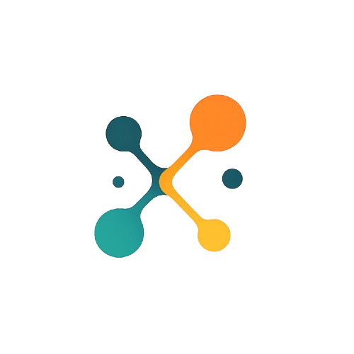

<p align="center">
  <a href="https://neurosemantica.ai">
    
  </a>
</p>

# KGInspector

**Semantic diff engine for RDF Knowledge Graphs**

KGInspector compares two versions of an RDF graph and surfaces exactly what changed: added/deleted triples, literal edits, node renames, subject/predicate/object-level mutations, and compound structural shifts. A React frontend visualises the diff as an interactive graph.

## How it works

KGInspector canonicalizes both RDF graphs, matches blank nodes via Weisfeiler-Lehman hashing and Gromov-Wasserstein optimal transport, then runs parallel SPARQL queries against a [pyoxigraph](https://github.com/oxigraph/oxigraph) store to surface added/deleted triples, literal edits, node renames, and structural shifts. Results stream to the UI as newline-delimited JSON.

## Deploy with Docker

```bash
# clone and start
git clone https://github.com/neurosemantica/KGInspectorOS
cd KGInspectorOS
docker compose up --build
```

The service is available at **http://localhost:8000**.

| Variable  | Default | Description                     |
|-----------|---------|---------------------------------|
| `PORT`    | `8000`  | Port the server listens on      |
| `WORKERS` | `4`     | Granian ASGI worker count       |

To change the port:

```bash
PORT=9000 docker compose up --build
```

The container runs a non-root `app` user and exposes a `/health` endpoint used by the built-in healthcheck.

## A note on AI assistance

AI tooling was used during development for specific, well-defined sub-tasks (e.g. generating boilerplate, suggesting algorithmic patterns). All AI-assisted code was reviewed, tested, and where necessary rewritten by professional developers. No AI output was merged without human verification.

## Contributing

Contributions are welcome! Feel free to open issues, submit pull requests, or suggest improvements.

## License

See [LICENSE.txt](LICENSE.txt).
